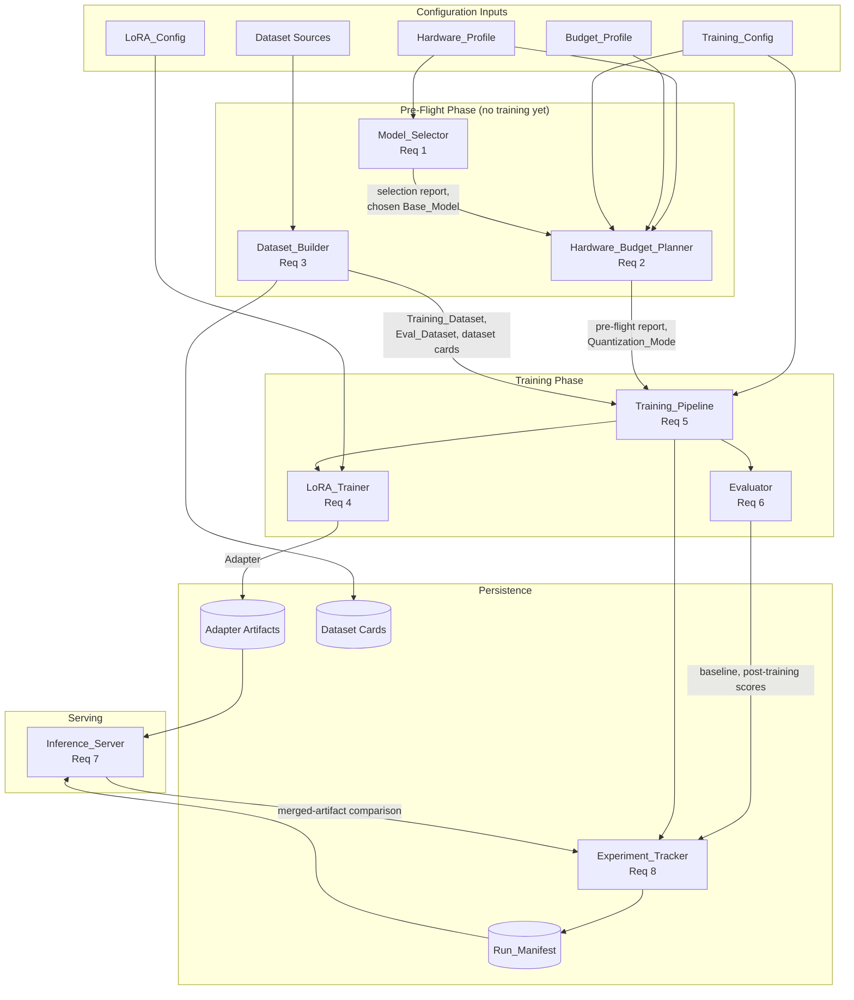
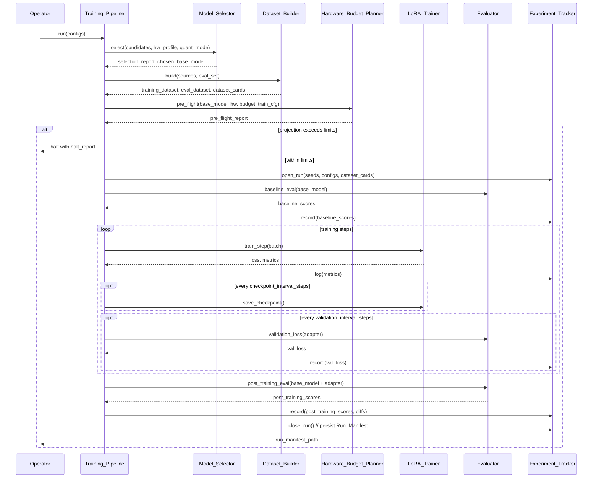

# Design Document: Math LoRA Fine-Tuning Pipeline

## Overview

This design describes a LoRA (Low-Rank Adaptation) fine-tuning pipeline that adapts an open-weight base LLM (Qwen, DeepSeek, or Doubao family) to produce step-by-step mathematical reasoning, including indefinite and definite integrals and symbolic derivations. The pipeline is operated by a single student under tight VRAM and monetary budget constraints, so feasibility checks (Requirement 1, Requirement 2) are first-class system concerns alongside training and evaluation.

The design organizes the system into eight cooperating components that map directly onto the eight requirement groups:

| Component | Primary Requirements |
|---|---|
| `Model_Selector` | Requirement 1 |
| `Hardware_Budget_Planner` | Requirement 2 |
| `Dataset_Builder` (data preparation) | Requirement 3 |
| `LoRA_Trainer` | Requirement 4 |
| `Training_Pipeline` (orchestrator) | Requirement 5 |
| `Evaluator` | Requirement 6 |
| `Inference_Server` | Requirement 7 |
| `Experiment_Tracker` | Requirement 8 |

### Design Goals

- **Feasibility before compute.** No training step runs until the `Hardware_Budget_Planner` has produced a pre-flight report (Requirement 2.5) and the `Model_Selector` has emitted a selection report (Requirement 1.6).
- **Reproducibility.** Every run is fully described by a `Run_Manifest` that pins configs, dataset hashes, dependency versions, seeds, and git state (Requirement 8).
- **Determinism in evaluation.** Baseline (pre-training) and post-training evaluations use identical decoding parameters and prompts (Requirement 6.3).
- **Adapter portability.** Adapters are versioned artifacts that record their `Base_Model` identifier and revision so the `Inference_Server` can refuse mismatched loads (Requirement 7.2).

### Key Design Decisions and Rationales

1. **Use a mature LoRA library, not a custom implementation.** We will use `peft` (HuggingFace Parameter-Efficient Fine-Tuning) on top of `transformers`. Rationale: LoRA has well-known correctness pitfalls (gradient masking, scaling factor application, target-module discovery) that an audited library handles. ([HuggingFace PEFT documentation](https://huggingface.co/docs/peft))
2. **Use `bitsandbytes` for `nf4` 4-bit quantization (QLoRA).** Rationale: Requirement 2.4 mandates `nf4` as the default for sub-24 GB VRAM hardware; QLoRA's `nf4` format with paged optimizer is the published reference implementation. ([QLoRA paper, Dettmers et al. 2023](https://arxiv.org/abs/2305.14314))
3. **Decouple the `Hardware_Budget_Planner` from the trainer.** Rationale: Requirement 2.6, 2.7, 2.8 require halting before any training step, so the planner is a separate gate that produces a pre-flight report consumed by the orchestrator.
4. **Separate `Dataset_Builder` from training.** Rationale: Requirements 3.7 and 8.3 require dataset cards and content hashes to be fully resolved before training, so dataset preparation is an offline (or pre-training) phase whose output is content-hashed.
5. **Manifest-first design for `Experiment_Tracker`.** Rationale: Requirement 8.10 requires bit-for-bit reproducibility (within 0.001 metric tolerance) across runs with identical manifests, which is only achievable if the manifest is the authoritative input record.
6. **Score `Custom_Integral_Set` with three explicit equivalence rules** (`string_equality`, `numerical_equality_with_tolerance`, `symbolic_equivalence`) per Requirement 6.6. Rationale: math answers admit multiple equivalent forms ($\frac{1}{2}$ vs `0.5` vs `\\sin^2(x)+\\cos^2(x)` simplified to `1`), and a single string match is too brittle. SymPy will provide `symbolic_equivalence`. ([SymPy documentation](https://docs.sympy.org/))

### Research Notes

- **VRAM estimation formula** (used by `Model_Selector` per Requirement 1.3): For LoRA training, the dominant terms are base weights, LoRA gradients, optimizer state on trainable parameters only, and activations. Following the QLoRA paper, base weight memory is `params * bytes_per_param(quantization_mode)`, where `nf4 = 0.5`, `int8 = 1.0`, `fp16/bf16 = 2.0`. Adam optimizer state for LoRA params is `8 * trainable_params` bytes (two fp32 moments). Activation memory scales as `O(batch_size * seq_len * hidden_size * num_layers)` and is reduced by gradient checkpointing. The exact coefficients are exposed in the selection report per Requirement 1.3.
- **Candidate base model context.** Qwen2.5-Math (1.5B/7B), DeepSeek-Math (7B), and Doubao open-weight checkpoints are the primary candidates. Each has documented GSM8K and MATH baselines that the `Model_Selector` ingests as inputs (Requirement 1.1). The selector itself never re-runs these baselines; it consumes the operator's declared values.
- **Benchmark protocols.** GSM8K uses `#### <answer>` extraction with exact-match on the numeric answer ([GSM8K paper, Cobbe et al. 2021](https://arxiv.org/abs/2110.14168)). MATH uses `\\boxed{...}` extraction with normalization rules from the original release ([MATH paper, Hendrycks et al. 2021](https://arxiv.org/abs/2103.03874)). Both protocols are pinned in the evaluation report (Requirement 6.5).

---

## Architecture

### High-Level Component Diagram



### Phase Sequencing

The system is organized as three sequential phases plus serving:

1. **Pre-flight phase** (no training step runs):
   - `Model_Selector` produces a selection report and chooses a `Base_Model` (Requirement 1.6).
   - `Dataset_Builder` ingests, normalizes, deduplicates, and splits datasets, producing dataset cards (Requirement 3.7) and the held-out validation split (Requirement 3.5).
   - `Hardware_Budget_Planner` produces a pre-flight report containing projected wall-clock time, projected cost, and projected peak VRAM (Requirement 2.5). If any projection exceeds its limit, the pipeline halts here (Requirement 2.6, 2.7, 2.8).

2. **Training phase**:
   - `Training_Pipeline` runs `LoRA_Trainer` with the resolved `LoRA_Config`, writing checkpoints (Requirement 5.2), logging metrics (Requirement 5.5), evaluating the validation split (Requirement 5.8), and sampling peak VRAM (Requirement 2.10).
   - Before the first training step, `Evaluator` runs the **baseline** evaluation on `Base_Model` alone (Requirement 6.1).
   - After the final training step, `Evaluator` runs the **post-training** evaluation on `Base_Model + Adapter` (Requirement 6.2).
   - `Experiment_Tracker` persists the `Run_Manifest` (Requirement 8.5).

3. **Serving phase** (independent of training):
   - `Inference_Server` loads `Base_Model` plus zero or more named `Adapter`s (Requirement 7.1), validating each Adapter's recorded `Base_Model` identifier and revision (Requirement 7.2).

### Sequence Diagram: A Single Training Run



### Cross-Cutting Concerns

- **Determinism.** Random seeds for the standard library, the numerical computing library, and the deep learning framework (CPU and accelerator generators) are set before any data shuffling (Requirement 5.6) and recorded in the `Run_Manifest` (Requirement 8.2).
- **Resumability.** Checkpoints contain Adapter weights, optimizer state, scheduler state, RNG states, and the step counter (Requirement 5.3). Resume validates checkpoint integrity before any training step (Requirement 5.4).
- **Halt-before-train invariant.** Any condition that violates feasibility (Requirement 2.6/2.7/2.8), missing config fields (Requirement 2.3), invalid `LoRA_Config` (Requirement 4.9), or invalid checkpoint (Requirement 5.4) MUST halt before the first training step. This is enforced by a single `pre_train_gate()` call in `Training_Pipeline`.

---

## Components and Interfaces

This section describes each component's responsibilities and its public interface (presented as language-agnostic signatures; the implementation language is Python with `transformers`/`peft`/`bitsandbytes`).

### 1. `Model_Selector` (Requirement 1)

**Responsibilities:**
- Validate candidate metadata (Requirement 1.1, 1.10).
- Estimate minimum VRAM for LoRA training per candidate (Requirement 1.3).
- Mark candidates as feasible or infeasible (Requirement 1.4).
- Rank feasible candidates by a deterministic score (Requirement 1.5).
- Emit a `selection_report` (Requirement 1.6).
- When no candidate is feasible, suggest a smaller VRAM gap or alternative `Quantization_Mode` (Requirement 1.7).

**Interface:**

```text
select(
    candidates: list[BaseModelCandidate],
    hardware_profile: HardwareProfile,
    quantization_mode: QuantizationMode,
    sequence_length: int  # 128..8192 inclusive
) -> SelectionReport
```

**VRAM estimation formula (documented per Requirement 1.3):**

```
estimated_vram_gb =
    base_weights_bytes(params, quantization_mode)
  + lora_gradient_bytes(trainable_params)
  + optimizer_state_bytes(trainable_params)        # 8 * trainable_params for AdamW
  + activation_bytes(batch_size, seq_len, hidden_size, num_layers, gradient_checkpointing)
  + overhead_bytes
```

Coefficients (`bytes_per_param` per `Quantization_Mode`, optimizer multiplier, activation coefficient, overhead) are listed in the selection report.

**Scoring function (Requirement 1.5):**

```
score = w_gsm * normalize(gsm8k_baseline)
      + w_math * normalize(math_baseline)
      + w_params * normalize(param_count_b)
      + w_license * license_permissiveness
```

`license_permissiveness` is a value in `[0.0, 1.0]` derived from the three boolean license flags (Requirement 1.8). The weights `w_gsm + w_math + w_params + w_license = 1.0` and the tie-breaker rule (lexicographic on `model_id`) are listed in the report.

### 2. `Hardware_Budget_Planner` (Requirement 2)

**Responsibilities:**
- Load `Hardware_Profile` and `Budget_Profile` from configuration (Requirement 2.1, 2.2).
- Halt with field-level errors if either is missing or invalid (Requirement 2.3).
- Choose default `Quantization_Mode` based on VRAM (Requirement 2.4).
- Produce a pre-flight report with projected time, cost, and peak VRAM (Requirement 2.5).
- Halt with suggested knob reductions if any projection exceeds its limit (Requirement 2.6/2.7/2.8).
- At end-of-run, emit cost reconciliation if cloud GPUs are used (Requirement 2.12).

**Interface:**

```text
plan(
    hardware_profile: HardwareProfile,
    budget_profile: BudgetProfile,
    base_model: BaseModelCandidate,
    training_config: TrainingConfig
) -> PreFlightReport

reconcile_cost(
    pre_flight: PreFlightReport,
    actual_gpu_hours: float
) -> CostReconciliation
```

**Knob-reduction suggestion algorithm.** When peak VRAM, time, or cost exceeds the limit, the planner does a search over the configurable knobs (`batch_size`, `sequence_length`, `gradient_accumulation_steps`, `dataset_size`, `max_steps`) and returns the smallest single-knob change that brings the projection within the limit. The chosen knob and its suggested value are recorded in the halt report.

### 3. `Dataset_Builder` (Requirement 3)

**Responsibilities:**
- Ingest from multiple sources (Requirement 3.1).
- Normalize each record into the `Reasoning_Format` (Requirement 3.2).
- Reject malformed records with reasons (Requirement 3.3).
- Deduplicate by canonicalized `problem` text (Requirement 3.4).
- Split into training and validation, ensuring no leakage from `Eval_Dataset` (Requirement 3.5).
- Preserve LaTeX (Requirement 3.6).
- Apply tokenizer-aware truncation that preserves `final_answer` (Requirement 3.8) or rejects records whose answer alone exceeds `max_seq_len` (Requirement 3.9).
- Exclude `Custom_Integral_Set` problems from training (Requirement 3.10).
- Emit a `dataset_card` per source (Requirement 3.7).

**Interface:**

```text
build(
    sources: list[DatasetSource],
    eval_dataset: EvalDataset,
    custom_integral_set: CustomIntegralSet | None,
    canonicalization_fn: CanonicalizationFn,
    max_seq_len: int,
    seed: int,
    val_fraction: float  # 0.05..0.20
) -> DatasetBuildResult
```

`DatasetBuildResult` contains `training_dataset`, `validation_dataset`, `dataset_cards` (one per source), and a `content_hash` over the final concatenated training set.

**Canonicalization function (Requirement 3.4).** Default: lowercase, strip leading and trailing whitespace, collapse internal whitespace to single space, strip a documented set of trailing punctuation. The exact function is recorded by reference (function name + version) in each dataset card.

### 4. `LoRA_Trainer` (Requirement 4)

**Responsibilities:**
- Validate `LoRA_Config` (Requirement 4.1, 4.2, 4.9).
- Apply LoRA only to modules in `target_modules`; freeze all other parameters (Requirement 4.3).
- Default `target_modules` to attention `q_proj` and `v_proj` if unset (Requirement 4.4).
- Serialize the Adapter with config and base model identity (Requirement 4.5).
- Report trainable parameter count and ratio (Requirement 4.6).
- Refuse to overwrite an existing Adapter at the same run-id path (Requirement 4.7).
- Load `Base_Model` in 4-bit when `Quantization_Mode == nf4`, but keep LoRA weights in `bf16`/`fp16` (Requirement 4.8).

**Interface:**

```text
configure(
    base_model: LoadedBaseModel,
    lora_config: LoRAConfig,
    quantization_mode: QuantizationMode
) -> ConfiguredTrainer

train_step(batch: TokenizedBatch) -> StepMetrics

save_adapter(
    path: PathLike,
    run_id: str,
    base_model_identifier: str,
    base_model_revision: str
) -> SavedAdapterInfo  # raises if path exists for run_id
```

### 5. `Training_Pipeline` (Requirement 5)

**Responsibilities:**
- Run training to `max_steps` or `max_epochs`, whichever first (Requirement 5.1).
- Checkpoint every `checkpoint_interval_steps`, retaining most-recent and best-val-loss checkpoints (Requirement 5.2).
- Resume from a checkpoint, restoring all required state (Requirement 5.3, 5.4).
- Log loss, learning rate, tokens/sec at `logging_interval_steps` (Requirement 5.5).
- Set RNG seeds before any data shuffling (Requirement 5.6).
- Halt on non-finite loss with a diagnostic record (Requirement 5.7).
- Evaluate validation split at `validation_interval_steps` (Requirement 5.8).
- Aggregate cross-rank metrics in multi-GPU mode (Requirement 5.9).
- Sample peak VRAM at least once per 100 steps (Requirement 2.10).

**Interface:**

```text
run(configs: ResolvedConfigs) -> RunResult
resume(checkpoint_path: PathLike, configs: ResolvedConfigs) -> RunResult
```

**Pre-train gate.** Before the first training step, the pipeline executes:

```
pre_train_gate():
    selection_report = Model_Selector.select(...)
    require selection_report.has_chosen_model
    pre_flight = Hardware_Budget_Planner.plan(...)
    require pre_flight.peak_vram_gb <= hw.vram_per_gpu_gb
    require pre_flight.projected_hours <= budget.max_hours
    require pre_flight.projected_cost <= budget.max_cost
    require LoRA_Trainer.validate(lora_config) is ok
    if resuming:
        require checkpoint integrity
```

If any check fails, the pipeline halts and `Experiment_Tracker.persist_halt_manifest()` is called within 60 seconds (Requirement 8.6).

### 6. `Evaluator` (Requirement 6)

**Responsibilities:**
- Run baseline evaluation on `Base_Model` before the first training step (Requirement 6.1).
- Run post-training evaluation on `Base_Model + Adapter` (Requirement 6.2) with identical decoding parameters (Requirement 6.3).
- Compute absolute score difference and relative percentage change per benchmark (Requirement 6.4).
- Score GSM8K and MATH using their published protocols (Requirement 6.5).
- Score `Custom_Integral_Set` per declared `equivalence_rule` (Requirement 6.7).
- Count parse failures separately from semantic errors (Requirement 6.8).
- Emit an evaluation report with per-benchmark stats and a stratified breakdown of `Custom_Integral_Set` (Requirement 6.9).
- Support `quick_eval` mode with a stratified subset (Requirement 6.10).

**Interface:**

```text
evaluate(
    model_under_test: ModelUnderTest,  # base_model alone OR base_model + adapter
    benchmarks: list[Benchmark],        # GSM8K, MATH, Custom_Integral_Set
    decoding_params: DecodingParams,
    mode: Literal["full", "quick_eval"],
    quick_eval_fraction: float | None,  # 0.10..1.00 if quick_eval
    seed: int
) -> EvaluationReport
```

**Equivalence rules (Requirement 6.7):**

- `string_equality`: `normalize_whitespace(extracted) == normalize_whitespace(reference)`
- `numerical_equality_with_tolerance`: `abs(extracted_numeric - reference_numeric) <= tolerance`
- `symbolic_equivalence`: `simplify(extracted_expr - reference_expr) == 0` via SymPy

A response that cannot be parsed into the expected form for the equivalence rule is counted as a parse failure (Requirement 6.8) and as incorrect.

### 7. `Inference_Server` (Requirement 7)

**Responsibilities:**
- Load `Base_Model` plus 0 to `max_adapters` named Adapters (Requirement 7.1).
- Validate each Adapter's `(base_model_id, revision)` against the loaded base (Requirement 7.2).
- Respond in `Reasoning_Format` (Requirement 7.3).
- Switch active adapter without unloading the base (Requirement 7.4).
- Honor `no_adapter` for base-only inference (Requirement 7.5).
- Load in 4-bit if training used `nf4`, and record per-benchmark accuracy delta vs. training-precision inference (Requirement 7.6).
- Accept and record decoding parameters (Requirement 7.7).
- Compare merged-artifact outputs to unmerged outputs on at least 10 prompts under greedy decoding (Requirement 7.8).

**Interface:**

```text
load_base(model_id: str, revision: str, quantization_mode: QuantizationMode) -> ServerHandle
load_adapter(handle: ServerHandle, name: str, adapter_path: PathLike) -> AdapterLoadResult
set_active_adapter(handle: ServerHandle, name: str | "no_adapter") -> None
generate(handle: ServerHandle, prompt: str, decoding: DecodingParams) -> ReasoningResponse
merge_adapter(handle: ServerHandle, adapter_name: str, output_path: PathLike) -> MergedArtifactInfo
```

### 8. `Experiment_Tracker` (Requirement 8)

**Responsibilities:**
- Open a run and assign a run id (Requirement 8.1).
- Record code commit hash, OS, Python version, accelerator driver, configs, dataset cards, dataset content hashes, dependency lockfile (Requirement 8.1, 8.2, 8.3, 8.9).
- Stream metrics from `Training_Pipeline` and `Evaluator` (Requirement 8.4).
- Persist the `Run_Manifest` within 60 seconds of run completion or halt, with up to 3 retries (Requirement 8.5, 8.6, 8.7).
- Capture dirty-tree state (parent commit + uncommitted-content hash) when the working tree is dirty (Requirement 8.8).
- Emit a manifest diff comparing two runs (Requirement 8.11).

**Interface:**

```text
open_run(configs, hw, budget, dataset_cards, dependency_lock) -> RunHandle
log_metric(handle, step, name, value) -> None
record_event(handle, event) -> None
close_run(handle, status: Literal["completed", "halted"], halt_reason: str | None) -> RunManifest
diff_runs(manifest_a: RunManifest, manifest_b: RunManifest, tolerance: float = 0.001) -> ManifestDiff
```

---

## Data Models

### `Reasoning_Format`

```text
ReasoningRecord {
    problem: NonEmptyString
    solution_steps: list[NonEmptyString]   # length >= 1
    final_answer: NonEmptyString
}
```

### `BaseModelCandidate` (input to `Model_Selector`)

```text
BaseModelCandidate {
    model_id: str
    revision: str
    family: Literal["qwen", "deepseek", "doubao", ...]
    param_count_b: float                    # billions, > 0
    license_id: str
    license_allows_finetuning: bool
    license_allows_adapter_redistribution: bool
    license_allows_commercial_use: bool
    native_context_length_tokens: int       # > 0
    tokenizer_family: str
    baseline_gsm8k: float                   # 0.0..1.0
    baseline_math: float                    # 0.0..1.0
}
```

### `HardwareProfile`

```text
HardwareProfile {
    gpu_model: str
    gpu_count: int                  # >= 1
    vram_per_gpu_gb: int            # 1..1024
    system_ram_gb: int              # > 0
    disk_space_gb: int              # > 0
    accelerator_family: Literal["cuda", "rocm", "metal", "cpu"]
    deployment: Literal["local", "cloud"]
}
```

### `BudgetProfile`

```text
BudgetProfile {
    max_cost: float                 # > 0
    currency: str
    max_wallclock_hours: float      # > 0
    cost_rate_per_gpu_hour: float   # >= 0, same currency as max_cost
}
```

### `QuantizationMode`

```text
QuantizationMode = Literal["fp16", "bf16", "int8", "nf4"]
```

### `LoRAConfig`

```text
LoRAConfig {
    r: int                                       # 4..128
    alpha: float                                 # > 0
    dropout: float                               # 0.0..1.0
    target_modules: list[str] | None             # None => default to ["q_proj", "v_proj"]
    bias: Literal["none", "all", "lora_only"]
}
```

### `Adapter` (artifact directory contents)

```text
AdapterArtifact {
    weights/                     # LoRA delta weights
    lora_config.json             # resolved LoRAConfig with all values
    base_model_ref.json {
        base_model_identifier: str
        base_model_revision: str
    }
    adapter_card.json            # run_id, training run reference
}
```

### `SelectionReport`

```text
SelectionReport {
    candidates: list[CandidateEntry]
    chosen_model_id: str | null
    weights: { w_gsm: float, w_math: float, w_params: float, w_license: float }
    tie_breaker_rule: str
    vram_estimation_coefficients: object       # bytes_per_param, optimizer_mult, activation_coef, overhead
    fallback_suggestion: FallbackSuggestion | null
    error: str | null                          # set if candidate list empty
}

CandidateEntry {
    model_id: str
    declared_param_count_b: float
    estimated_min_vram_gb: float
    feasible: bool
    vram_shortfall_gb: float | null            # 1 decimal place if infeasible
    score: float | null                        # null if ineligible/infeasible
    license_allows_finetuning: bool
    license_allows_adapter_redistribution: bool
    license_allows_commercial_use: bool
    license_id: str
    eligible: bool
    missing_fields: list[str]
}

FallbackSuggestion {
    candidate_model_id: str
    smallest_vram_increase_gb: float
    alternative_quantization_mode: QuantizationMode | null
}
```

### `PreFlightReport`

```text
PreFlightReport {
    base_model_id: str
    quantization_mode: QuantizationMode
    projected_wallclock_hours: float
    projected_cost: float
    projected_currency: str
    projected_peak_vram_gb_per_gpu: float
    inputs: {
        batch_size: int,
        sequence_length: int,
        gradient_accumulation_steps: int,
        gradient_checkpointing: bool
    }
    halt: bool
    halt_reason: Literal["vram", "time", "cost"] | null
    suggested_knob_change: KnobChange | null
}
```

### `DatasetCard` (per source)

```text
DatasetCard {
    source_name: str
    license: str
    delimiter: str                       # final_answer delimiter
    canonicalization_fn_id: str
    canonicalization_fn_version: str
    record_count_after_ingest: int
    record_count_after_normalization: int
    record_count_after_dedup: int
    truncation_count: int
    rejection_count: int
    rejection_reasons: { [reason: str]: int }
    final_answer_too_long_rejection_count: int
    custom_integral_overlap_excluded: int
    val_split_seed: int
    val_split_fraction: float
    content_hash: str
}
```

### `EvaluationReport`

```text
EvaluationReport {
    decoding_params: DecodingParams
    benchmarks: list[BenchmarkResult]
    custom_integral_breakdown: {
        indefinite: BenchmarkResult,
        definite: BenchmarkResult,
        derivation: BenchmarkResult
    }
    mode: Literal["full", "quick_eval"]
}

BenchmarkResult {
    benchmark_id: str
    sample_size: int
    baseline_score: float          # 0.0..1.0
    post_training_score: float     # 0.0..1.0
    absolute_diff: float           # -1.0..1.0
    relative_pct_change: float
    parse_failure_count: int
    semantic_error_count: int
    protocol_source: str
    protocol_version: str
}
```

### `RunManifest`

```text
RunManifest {
    run_id: str
    start_utc: timestamp
    end_utc: timestamp
    git_commit_hash: str
    git_dirty: bool
    git_dirty_content_hash: str | null
    os_id: str
    python_version: str
    accelerator_driver_version: str
    resolved_configs: { training: ..., lora: ..., decoding: ... }
    base_model: { model_id: str, revision: str }
    quantization_mode: QuantizationMode
    lora_config: LoRAConfig
    hardware_profile: HardwareProfile
    budget_profile: BudgetProfile
    seeds: { stdlib: int, numpy: int, framework_cpu: int, framework_accelerator: int }
    dataset_cards: list[DatasetCard]
    training_dataset_content_hash: str
    eval_dataset_content_hash: str
    dependency_lock: { [pkg: str]: str }
    metrics: list[MetricSample]
    vram_samples: list[{ step: int, peak_vram_gb_per_gpu: list[float] }]
    baseline_eval: EvaluationReport
    post_training_eval: EvaluationReport
    cost_reconciliation: CostReconciliation | null
    merge_comparison: MergeComparison | null
    reproducibility_tolerance: 0.001
    status: Literal["completed", "halted"]
    halt_reason: str | null
    last_completed_step: int | null
    multi_gpu: { strategy: str, world_size: int, per_rank_batch_size: int } | null
}
```

### Storage Layout

```
{artifact_root}/
  runs/
    {run_id}/
      adapter/
        weights/
        lora_config.json
        base_model_ref.json
        adapter_card.json
      checkpoints/
        latest/
        best_val/
      manifest.json                    # Run_Manifest
      logs/
  datasets/
    {dataset_content_hash}/
      training.parquet
      validation.parquet
      cards/
        gsm8k.json
        math.json
        custom_integral_set.json
```


---

## Correctness Properties

*A property is a characteristic or behavior that should hold true across all valid executions of a system — essentially, a formal statement about what the system should do. Properties serve as the bridge between human-readable specifications and machine-verifiable correctness guarantees.*

The following properties are universally quantified statements that drive property-based testing for this feature. Each property cites the requirement clauses it validates. Where a property combines multiple closely-related acceptance criteria into a single comprehensive statement, this is noted in the validation reference.

### Property 1: VRAM estimation is deterministic and monotonic

*For any* candidate base model, hardware profile, sequence length, and quantization mode, the VRAM estimation function SHALL be deterministic (same inputs produce the same estimate), monotonically non-decreasing in `param_count_b` and `sequence_length`, and monotonically non-increasing as `Quantization_Mode` moves from `fp16` to `bf16` to `int8` to `nf4` (all other inputs held constant). The coefficients exposed in the selection report SHALL exactly explain the computed estimate.

**Validates: Requirements 1.3**

### Property 2: Selection report soundness

*For any* list of candidate base models, the emitted selection report SHALL satisfy: (a) every input candidate appears in the report exactly once keyed by `model_id`; (b) `feasible == True` if and only if `estimated_min_vram_gb <= hardware_profile.vram_per_gpu_gb`; (c) `vram_shortfall_gb` for infeasible candidates equals `round(estimated_min_vram_gb - hw.vram_per_gpu_gb, 1)`; (d) candidates with any missing required field have `eligible == False`, no numeric score, and a `missing_fields` list naming exactly the absent fields; (e) `chosen_model_id` is `null` or refers to an eligible feasible candidate with the maximum score under the documented tie-breaker; (f) every score, when present, lies in `[0.0, 1.0]`.

**Validates: Requirements 1.4, 1.5, 1.6, 1.8, 1.10**

### Property 3: Fallback suggestion is corrective

*For any* candidate list in which no candidate is feasible at the given `Quantization_Mode`, the report's `fallback_suggestion`, when it names an `alternative_quantization_mode`, SHALL produce an estimated VRAM no greater than `hardware_profile.vram_per_gpu_gb` for the highest-scoring candidate when the estimator is rerun under that mode; and the named `smallest_vram_increase_gb` SHALL be the minimum positive increment that makes the highest-scoring candidate feasible at the original mode.

**Validates: Requirements 1.7**

### Property 4: Pre-flight halt suggestion is corrective

*For any* training configuration whose pre-flight projection exceeds a hardware or budget limit (peak VRAM, wall-clock time, or monetary cost), the planner SHALL halt before any training step and SHALL emit a `suggested_knob_change` such that, when that knob change is applied to the training configuration and the planner is rerun, the corresponding projection is at or below its limit.

**Validates: Requirements 2.6, 2.7, 2.8**

### Property 5: Default `Quantization_Mode` for low VRAM

*For any* `Hardware_Profile` with `vram_per_gpu_gb < 24` and any training configuration in which `quantization_mode` is unset, the resolved `Quantization_Mode` SHALL be `nf4`; *for any* training configuration in which `quantization_mode` is explicitly set, the resolved value SHALL equal the explicit setting.

**Validates: Requirements 2.4**

### Property 6: Periodic VRAM sampling coverage

*For any* simulated training run of `N` steps with `N >= 100`, *for any* contiguous window of 100 step indices `[k, k+100)` within `[0, N)`, the recorded `vram_samples` SHALL contain at least one sample whose step index lies in that window.

**Validates: Requirements 2.10**

### Property 7: Cost reconciliation arithmetic

*For any* `(pre_flight_report, actual_gpu_hours)`, the cost reconciliation SHALL satisfy: `actual_cost == actual_gpu_hours * cost_rate_per_gpu_hour`; `absolute_diff == abs(actual_cost - projected_cost)`; and `pct_diff == (absolute_diff / projected_cost) * 100` when `projected_cost > 0`.

**Validates: Requirements 2.12**

### Property 8: `Reasoning_Format` normalization preserves invariants

*For any* input record that the `Dataset_Builder` accepts, the normalized output record SHALL have a non-empty `problem`, a `solution_steps` list with at least one non-empty entry, a non-empty `final_answer`, and SHALL preserve LaTeX delimiters and mathematical notation that appeared in the input.

**Validates: Requirements 3.2, 3.6**

### Property 9: Dataset accounting balance

*For any* set of input records ingested by `Dataset_Builder`, the equation `len(input_records) == len(accepted_records) + sum(rejection_reasons.values())` SHALL hold, and every rejected record SHALL have an associated reason recorded in the dataset card.

**Validates: Requirements 3.3**

### Property 10: Deduplication completeness

*For any* set of input records and any canonicalization function, no two records in the deduplicated output SHALL share the same `canonicalize(problem)` value, and the deduplication count recorded in the dataset card SHALL equal `len(input_records) - len(deduplicated_records)`.

**Validates: Requirements 3.4**

### Property 11: Validation split correctness

*For any* deduplicated training records, any `val_fraction` in `[0.05, 0.20]`, any deterministic seed, and any `Eval_Dataset`, the produced validation split SHALL contain a number of records `n` with `floor(0.05 * total) <= n <= ceil(0.20 * total)`; SHALL share no canonicalized `problem` with the `Eval_Dataset`; and SHALL be byte-identical between two runs that share the same seed and inputs.

**Validates: Requirements 3.5**

### Property 12: Tokenizer-aware truncation preserves `final_answer`

*For any* record where the tokenized record exceeds `max_seq_len` and the tokenized `final_answer` alone does not exceed `max_seq_len`, the truncated record SHALL contain the entire token sequence of `final_answer`. *For any* record where the tokenized `final_answer` alone exceeds `max_seq_len`, the record SHALL be rejected and counted in `final_answer_too_long_rejection_count` rather than in `truncation_count`.

**Validates: Requirements 3.8, 3.9**

### Property 13: `Custom_Integral_Set` isolation

*For any* `(training_inputs, custom_integral_set)`, no record in the produced `Training_Dataset` SHALL have a `canonicalize(problem)` value equal to the `canonicalize(problem)` value of any record in the `Custom_Integral_Set`.

**Validates: Requirements 3.10**

### Property 14: Trainable parameter set equals LoRA target set

*For any* `(base_model, lora_config)` accepted by `LoRA_Trainer`, after configuration: every base model parameter not in the resolved LoRA target SHALL have `requires_grad == False`; every LoRA adapter parameter on the resolved target modules SHALL have `requires_grad == True`; the reported trainable parameter count SHALL equal the sum of LoRA adapter parameter counts on those target modules; and the reported `trainable / total` ratio SHALL equal `trainable_count / total_count`. When `target_modules` is unset, the resolved targets SHALL be exactly the attention `q_proj` and `v_proj` modules.

**Validates: Requirements 4.3, 4.4, 4.6**

### Property 15: Adapter serialization round-trip

*For any* trained `Adapter` with a resolved `LoRAConfig` and `(base_model_identifier, base_model_revision)`, the sequence `save_adapter(path) -> load_adapter(path)` SHALL produce an Adapter whose LoRA weights are bit-identical, whose `LoRAConfig` is field-equal, and whose `base_model_ref` is field-equal to the original.

**Validates: Requirements 4.5**

### Property 16: Adapter overwrite is refused atomically

*For any* `(run_id, existing_adapter, new_adapter)` where an Adapter already exists at the resolved path for `run_id`, `save_adapter` SHALL reject the operation; the existing Adapter on disk SHALL remain bit-identical to its pre-call state.

**Validates: Requirements 4.7**

### Property 17: `nf4` honors quantization layout

*For any* `(base_model, lora_config)` configured with `Quantization_Mode == nf4`, after configuration: every base model weight tensor SHALL have a quantized dtype consistent with 4-bit storage, and every LoRA adapter weight tensor SHALL have a dtype in `{bf16, fp16}`.

**Validates: Requirements 4.8**

### Property 18: `LoRA_Config` field-level validation

*For any* `LoRAConfig` produced by mutating one field of a valid config to an invalid value (rank outside `[4, 128]`, dropout outside `[0.0, 1.0]`, bias not in `{none, all, lora_only}`, or `target_modules` containing a name absent from the base model), the `LoRA_Trainer` SHALL reject the configuration before training begins and SHALL surface an error identifying exactly the mutated field.

**Validates: Requirements 4.2, 4.9**

### Property 19: Training halts at the correct step

*For any* `(max_steps, max_epochs, dataset_size, batch_size)`, simulated training SHALL halt at exactly `min(max_steps, ceil(max_epochs * dataset_size / batch_size))` steps.

**Validates: Requirements 5.1**

### Property 20: Checkpoint retention invariant

*For any* simulated training run, after every checkpoint event the on-disk checkpoint set SHALL equal `{latest, best_val}`, where `latest` is the most recent checkpoint and `best_val` is the checkpoint whose recorded validation loss is minimum among all evaluations completed so far. When `latest == best_val` (the latest is also the best), only one checkpoint SHALL be retained.

**Validates: Requirements 5.2**

### Property 21: Resume round-trip equivalence

*For any* training run with deterministic seeds and any checkpoint step `k`, the run obtained by training from step 0 to step `N` SHALL produce metrics equal (within numeric tolerance) to those obtained by training from step 0 to step `k`, halting, and then resuming from the step-`k` checkpoint to step `N`.

**Validates: Requirements 5.3**

### Property 22: Corrupt checkpoint rejection

*For any* checkpoint path that does not exist or whose contents are missing any of `(adapter weights, optimizer state, scheduler state, RNG states, step counter)` or fail integrity check, `resume()` SHALL halt before executing any training step and SHALL surface an error identifying the checkpoint path and the missing or invalid field.

**Validates: Requirements 5.4**

### Property 23: Periodic event scheduling

*For any* `(total_steps, logging_interval_steps, validation_interval_steps)` with positive intervals, the set of training steps at which logging events fire SHALL equal the multiples of `logging_interval_steps` in `[1, total_steps]`, and the set of steps at which validation evaluation fires SHALL equal the multiples of `validation_interval_steps` in `[1, total_steps]`.

**Validates: Requirements 5.5, 5.8**

### Property 24: Seed-controlled determinism

*For any* `(training_config, seeds)`, two training runs that share identical configs, identical seeds, and identical dependency versions SHALL produce identical first-batch token sequences and identical recorded seeds in their respective `Run_Manifest`s.

**Validates: Requirements 5.6**

### Property 25: Non-finite loss triggers immediate halt with diagnostic

*For any* simulated training run in which loss becomes non-finite at step `k`, the `Training_Pipeline` SHALL halt within step `k` and SHALL emit a diagnostic record containing `step == k`, the most recent learning rate, and the path to the most recent checkpoint at which validation loss was finite.

**Validates: Requirements 5.7**

### Property 26: Multi-GPU metric aggregation

*For any* multi-GPU configuration with `world_size = W` and per-rank metrics `(loss_i, tokens_per_sec_i)` for `i in [0, W)`, the aggregated metrics emitted at each logging event SHALL satisfy `aggregated_loss == mean(loss_i)` and `aggregated_tokens_per_sec == sum(tokens_per_sec_i)`. The `Run_Manifest` SHALL record `strategy`, `world_size`, and `per_rank_batch_size`.

**Validates: Requirements 5.9**

### Property 27: Evaluation regime invariants

*For any* training run, the `baseline_eval` event SHALL precede the first training step and SHALL operate on the `Base_Model` alone (no Adapter); the `post_training_eval` event SHALL follow the last training step and SHALL operate on `Base_Model + Adapter`; both evaluations SHALL be performed on the same set of benchmark items; and `baseline_eval.decoding_params == post_training_eval.decoding_params` field-by-field including the random seed.

**Validates: Requirements 6.1, 6.2, 6.3**

### Property 28: Score difference arithmetic

*For any* `(baseline_score, post_training_score)` pair in `[0, 1] x [0, 1]`, the recorded `absolute_diff` SHALL equal `post_training_score - baseline_score` and SHALL lie in `[-1.0, 1.0]`; the recorded `relative_pct_change` SHALL equal `(absolute_diff / baseline_score) * 100` when `baseline_score > 0`, and SHALL be reported with the documented sentinel value when `baseline_score == 0`.

**Validates: Requirements 6.4**

### Property 29: `Custom_Integral_Set` structural constraints

*For any* loaded `Custom_Integral_Set`, `len(set) >= 50`; for each category in `{indefinite, definite, derivation}` the count SHALL be at least 10; and every problem SHALL declare a `reference_final_answer` and an `equivalence_rule` whose value lies in `{string_equality, numerical_equality_with_tolerance, symbolic_equivalence}`.

**Validates: Requirements 6.6**

### Property 30: Equivalence rule semantics

*For any* expression `x` and the rule `string_equality`, `equivalent(x, x) == True`. *For any* `(a, b)` and the rule `numerical_equality_with_tolerance` with tolerance `t`, `equivalent(a, b) == equivalent(b, a)` and `equivalent(a, b) == True` if and only if `abs(a - b) <= t`. *For any* expression `x` and the rule `symbolic_equivalence`, `equivalent(x, simplify(x)) == True`.

**Validates: Requirements 6.7**

### Property 31: Evaluation accounting balance

*For any* evaluation run over a benchmark of `S` items, `parse_failure_count + semantic_error_count + correct_count == S`; every parse-failure response SHALL be excluded from `correct_count`.

**Validates: Requirements 6.8**

### Property 32: `quick_eval` determinism and stratification

*For any* `(benchmark, fraction, seed)` with `fraction in [0.10, 1.00]`, the produced `quick_eval` subset SHALL have size `n` with `floor(fraction * total) <= n <= ceil(fraction * total)`; SHALL preserve the per-category stratification proportions of the full benchmark within an integer rounding tolerance; and two calls with the same `(benchmark, fraction, seed)` SHALL produce identical subsets. The evaluation report and `Run_Manifest` SHALL be labeled `quick_eval`.

**Validates: Requirements 6.10**

### Property 33: Adapter-base compatibility check

*For any* `(loaded_base, adapter)`, `load_adapter` SHALL succeed if and only if `adapter.base_model_identifier == loaded_base.identifier` and `adapter.base_model_revision == loaded_base.revision`; on rejection, the adapter SHALL remain unloaded and the error SHALL identify which of the two fields mismatched.

**Validates: Requirements 7.2**

### Property 34: Adapter switching preserves base load

*For any* sequence of `(load_adapter, set_active_adapter, generate)` calls on a single `Inference_Server` handle, the underlying `Base_Model` SHALL be loaded exactly once across the sequence (counted from `load_base` until handle release), and every `generate` call SHALL use the most recently set active adapter (or no adapter when active is `no_adapter`).

**Validates: Requirements 7.4, 7.5**

### Property 35: Decoding parameter validation

*For any* `DecodingParams` produced by mutating one field of a valid params object to an out-of-range value (`temperature` outside `[0.0, 2.0]`, `top_p` outside `[0.0, 1.0]`, `top_k` negative, or `max_new_tokens <= 0`), `generate` SHALL reject the request and SHALL surface an error identifying exactly the mutated field.

**Validates: Requirements 7.7**

### Property 36: Adapter merge equivalence

*For any* trained `Adapter` and any fixed prompt set of at least 10 prompts under greedy decoding (`temperature = 0.0, top_p = 1.0, top_k = 0`) with a fixed random seed, the token sequences produced by `Base_Model + Adapter` (unmerged) SHALL be identical to those produced by the merged-artifact model on the same prompt set.

**Validates: Requirements 7.8**

### Property 37: Faithful manifest recording

*For any* training run, the persisted `Run_Manifest` SHALL contain field-equal copies of the resolved `Base_Model` identifier and revision, `Quantization_Mode`, `LoRAConfig`, `HardwareProfile`, `BudgetProfile`, all four random seeds, all dataset cards, the training and eval dataset content hashes, and every metric emitted during training and evaluation. The manifest SHALL also contain `run_id`, start and end timestamps in UTC, the git commit hash, OS identifier, Python version, and accelerator driver version.

**Validates: Requirements 8.1, 8.2, 8.3, 8.4**

### Property 38: Manifest persistence latency

*For any* run that reaches a terminal state (completed or halted), the difference between the manifest persistence timestamp and the terminal-state event timestamp SHALL be at most 60 seconds. For halted runs, the persisted manifest SHALL have `status == "halted"`, a non-null `halt_reason`, and `last_completed_step` equal to the last step before the halt.

**Validates: Requirements 8.5, 8.6**

### Property 39: Persistence retry contract

*For any* persistence-failure injection pattern over four consecutive attempts, the `Experiment_Tracker` SHALL either persist the manifest within at most three retries (four attempts total, including the initial one) or surface an error identifying the manifest path and the failure cause. The tracker SHALL never surface an error before three retries have been attempted in response to transient failures.

**Validates: Requirements 8.7**

### Property 40: Dirty-tree recording

*For any* run start in which the git working tree contains uncommitted changes, the `Run_Manifest` SHALL record `git_dirty == True`, a non-null `git_commit_hash` equal to the parent commit, and a non-null `git_dirty_content_hash` equal to a content hash computed over the uncommitted changes. *For any* clean working tree, `git_dirty == False` and `git_dirty_content_hash == null`.

**Validates: Requirements 8.8**

### Property 41: Dependency pinning completeness

*For any* training run, every package name listed in the `Training_Pipeline` dependency manifest SHALL appear in `run_manifest.dependency_lock` with a non-null resolved version string.

**Validates: Requirements 8.9**

### Property 42: Reproducibility tolerance

*For any* pair of `Run_Manifest`s `(m_a, m_b)` whose resolved configs, dataset content hashes, code commit hashes (with `git_dirty == False`), dependency versions, hardware profiles, and random seeds are byte-equal, the absolute difference of every shared evaluation metric in `baseline_eval` and `post_training_eval` SHALL be at most `0.001`. The `reproducibility_tolerance` field of each manifest SHALL record the value `0.001`.

**Validates: Requirements 8.10**

### Property 43: Manifest diff identity

*For any* pair of `Run_Manifest`s `(m_a, m_b)`, the diff produced by `Experiment_Tracker.diff_runs(m_a, m_b)` SHALL be empty if and only if the serialized bytes of `m_a` and `m_b` are equal; *for any* metric whose absolute difference between `m_a` and `m_b` is at most the recorded tolerance, that metric SHALL not appear in the diff; *for any* configuration field or dataset content hash that differs between `m_a` and `m_b`, that field SHALL appear in the diff.

**Validates: Requirements 8.11**

---

## Error Handling

The system uses a small set of structured error categories. Each category names the failing field or resource, the component that detected the failure, and (where applicable) a corrective suggestion.

### Error Categories

| Category | Source | Trigger | Surface |
|---|---|---|---|
| `EmptyCandidateList` | `Model_Selector` | candidate list is empty (Req 1.9) | error returned, no selection performed |
| `IneligibleCandidate` | `Model_Selector` | candidate missing required field or license flag (Req 1.10) | candidate excluded from ranking, missing fields recorded in selection report |
| `ConfigLoadError` | `Hardware_Budget_Planner` | `Hardware_Profile` or `Budget_Profile` missing/invalid field (Req 2.3) | halt before training, error names file and field |
| `VRAMExceeded` | `Hardware_Budget_Planner` | projected peak VRAM > available (Req 2.6) | halt before training, halt report with projected/available VRAM and `suggested_knob_change` |
| `TimeBudgetExceeded` | `Hardware_Budget_Planner` | projected wall-clock > budget time (Req 2.7) | halt before training, halt report with projected/limit and `suggested_knob_change` |
| `CostBudgetExceeded` | `Hardware_Budget_Planner` | projected cost > budget cost (Req 2.8) | halt before training, halt report with projected/limit and `suggested_knob_change` |
| `RecordValidationError` | `Dataset_Builder` | record fails Reasoning_Format validation (Req 3.3) | record excluded, reason counted in dataset card |
| `FinalAnswerTooLong` | `Dataset_Builder` | tokenized `final_answer` alone exceeds `max_seq_len` (Req 3.9) | record rejected, counted in `final_answer_too_long_rejection_count` |
| `LoRAConfigInvalid` | `LoRA_Trainer` | rank/dropout/bias/target_modules out of range (Req 4.9) | reject before training, error names invalid field |
| `AdapterAlreadyExists` | `LoRA_Trainer` | save path occupied for `run_id` (Req 4.7) | reject save, existing adapter unchanged |
| `CheckpointInvalid` | `Training_Pipeline` | resume path missing or fails integrity check (Req 5.4) | halt before any training step, error names checkpoint path and missing field |
| `NonFiniteLoss` | `Training_Pipeline` | loss NaN/Inf (Req 5.7) | halt within current step, diagnostic with step, lr, last good checkpoint |
| `AdapterBaseMismatch` | `Inference_Server` | adapter `(model_id, revision)` ≠ loaded base (Req 7.2) | reject load, adapter remains unloaded, error names mismatched field |
| `DecodingParamsInvalid` | `Inference_Server` | decoding param out of declared range (Req 7.7) | reject request, error names invalid field |
| `ManifestPersistenceFailed` | `Experiment_Tracker` | persistence failed three retries (Req 8.7) | surface error with manifest path and failure cause |

### Halt vs. Continue Policy

- **Halt-before-train invariant.** Errors that occur in the pre-flight phase (config load, model selection, dataset build, pre-flight planning, LoRA config validation, checkpoint integrity for a resume) ALWAYS halt before any training step executes.
- **Halt-during-training.** Only `NonFiniteLoss` halts mid-training. The current step is not committed to the checkpoint stream, the most recent finite-val-loss checkpoint is identified in the diagnostic, and a halt manifest is persisted within 60 seconds (Req 8.6).
- **Continue-but-record.** Per-record validation failures in `Dataset_Builder` (`RecordValidationError`, `FinalAnswerTooLong`) do not halt the build; they are counted in the dataset card and the training proceeds with the accepted records, provided at least one record remains accepted.
- **Reject-but-preserve.** `AdapterAlreadyExists` and `AdapterBaseMismatch` reject the operation while leaving on-disk and in-memory state unchanged.

### Halt Report Schema

```text
HaltReport {
    halt_category: ErrorCategory
    component: ComponentName
    field_or_resource: str
    description: str
    suggested_knob_change: KnobChange | null    # populated for VRAMExceeded, TimeBudgetExceeded, CostBudgetExceeded
    diagnostic: object | null                   # populated for NonFiniteLoss
}
```

### Logging and Observability

- All halts call `Experiment_Tracker.close_run(status="halted", halt_reason=<category>)` (Req 8.6).
- Per-record dataset rejections are aggregated into `dataset_card.rejection_reasons` (Req 3.3).
- Mid-training events (logging, checkpoint write, validation evaluation, VRAM sample) are recorded as structured entries in the `Run_Manifest`'s `metrics` and `vram_samples` arrays.

---

## Testing Strategy

### Dual Approach: Unit Tests + Property Tests + Integration Tests

The pipeline contains components with distinct testing profiles:

- **Pure-function components** (`Model_Selector`, `Hardware_Budget_Planner`, `Dataset_Builder`, `Evaluator` scoring, `Experiment_Tracker` manifest construction and diff): heavy property-based testing — these are inputs-to-outputs functions where universal properties cover wide input spaces.
- **Stateful components with controllable state** (`LoRA_Trainer` configuration, `Inference_Server` adapter management, `Training_Pipeline` step scheduling): property-based testing on the state-machine layer with mocked underlying frameworks; integration tests against a tiny real model for end-to-end smoke.
- **External integrations** (real GPU memory measurement, real GSM8K/MATH benchmark protocols, real cloud cost reconciliation): integration tests with one to three representative examples, NOT property-based tests.

### Property-Based Testing

Property-based testing (PBT) IS appropriate for this feature. The pipeline contains pure-function logic (VRAM estimation, dataset normalization, deduplication, manifest serialization, equivalence rules), state-machine logic (training loop scheduling, adapter switching), and pre-flight feasibility computation — all of which admit universal "for all inputs X, property P(X) holds" statements.

**PBT framework.** We will use `hypothesis` (Python's mature property-based testing library) for unit-level properties, with `pytest` as the runner. Generators for domain types (`BaseModelCandidate`, `HardwareProfile`, `LoRAConfig`, `ReasoningRecord`, `RunManifest`) will be defined once and reused across properties.

**Configuration:**
- Each property test SHALL run a minimum of 100 iterations.
- Each property test SHALL be tagged with a comment of the form: `# Feature: math-lora-finetuning, Property {number}: {property_text}`.
- Each correctness property in this design document SHALL be implemented by a single property-based test (one test per property).
- Tests that interact with model weights or GPU memory SHALL use mocked backends so that 100 iterations remain cost-effective.
- Tests for `Equivalence Rule Semantics` (Property 30) and `Reasoning_Format Normalization` (Property 8) MAY use SymPy and a real tokenizer respectively, since these are in-process Python operations.

**Generators.** Domain generators will:
- Produce `BaseModelCandidate` instances with valid `param_count_b`, plausible baseline scores, and randomized license flags; a separate strategy will mutate one field to invalid for `IneligibleCandidate` tests.
- Produce `HardwareProfile` with `vram_per_gpu_gb in [1, 1024]` (the range declared in Req 1.2) including the threshold values (1, 8, 16, 24, 80) for boundary coverage.
- Produce `LoRAConfig` with `r in [4, 128]`, `dropout in [0.0, 1.0]`, valid bias values; a separate strategy mutates one field to invalid for Property 18.
- Produce `ReasoningRecord` with non-empty fields and a controlled probability of containing LaTeX delimiters and unicode math symbols.
- Produce simulated training runs as event traces (not real training) for state-machine properties (Properties 19, 20, 21, 23, 25, 26).

**Mocks.** State-machine properties for the trainer and inference server will use mock implementations of:
- The base model parameter graph (a list of named parameters with `requires_grad` flags).
- The optimizer, scheduler, and RNG state objects (for resume round-trip testing).
- The clock (for persistence latency testing).
- The disk (for checkpoint retention and adapter overwrite testing — using an in-memory filesystem stub).
- The GPU memory measurement (for VRAM sampling cadence testing).

### Unit Tests (Example-Based)

Example-based unit tests SHALL cover:
- Schema validation of every config file format (Req 1.1, 1.2, 2.1, 2.2, 4.1).
- The empty-candidate-list error case (Req 1.9).
- Each dataset source connector (Req 3.1) — one test per source, smoke-level.
- Each `Training_Pipeline` feature toggle (gradient checkpointing, gradient accumulation, mixed precision, nf4) — one test per toggle (Req 2.9).
- The single consumer GPU configuration (Req 2.11) — one example with mocked CUDA backend or one real run on the smallest feasible base model.

Unit tests are deliberately limited; behavioral coverage is concentrated in property tests. Unit tests focus on configuration plumbing and feature-toggle smoke checks.

### Integration Tests

Integration tests SHALL cover:
- Real GSM8K and MATH scoring on a small fixed sample (e.g., 10 items from each benchmark) verifying that scores match a known-good reference (Req 6.5). 1–3 examples are sufficient because the benchmark protocol is deterministic.
- One end-to-end training run on a small base model (e.g., Qwen2.5-0.5B if feasible, otherwise a tiny test transformer) on a small dataset, for at most 100 steps, verifying that the `Run_Manifest` is produced and complete.
- One real adapter-merge round-trip on a small adapter, verifying token-equality on the prompt set used by Property 36.
- One cloud-cost-reconciliation run with a stubbed cloud GPU (Req 2.12).
- One reproducibility check: two runs with byte-identical inputs, verifying `|metric_a - metric_b| <= 0.001` per Property 42.

### Items Not Suited to Property-Based Testing

The following acceptance criteria are INTEGRATION or SMOKE rather than PROPERTY:

- **Req 2.11** (consumer GPU completes without OOM) — depends on real hardware behavior; covered by an integration test on a single configuration with the smallest feasible base model.
- **Req 2.9** (feature toggle availability) — presence checks; covered by smoke tests.
- **Req 6.5** (GSM8K and MATH official protocol) — fixed external implementation; covered by integration tests against published reference scores on small samples.
- **Req 3.1** (source connectors) — interface availability; one smoke test per source.

### Testing Coverage Summary

| Property # | Validates Requirements | Test Class |
|---|---|---|
| 1 | 1.3 | Property |
| 2 | 1.4, 1.5, 1.6, 1.8, 1.10 | Property |
| 3 | 1.7 | Property |
| 4 | 2.6, 2.7, 2.8 | Property |
| 5 | 2.4 | Property |
| 6 | 2.10 | Property |
| 7 | 2.12 | Property |
| 8 | 3.2, 3.6 | Property |
| 9 | 3.3 | Property |
| 10 | 3.4 | Property |
| 11 | 3.5 | Property |
| 12 | 3.8, 3.9 | Property |
| 13 | 3.10 | Property |
| 14 | 4.3, 4.4, 4.6 | Property |
| 15 | 4.5 | Property |
| 16 | 4.7 | Property |
| 17 | 4.8 | Property |
| 18 | 4.2, 4.9 | Property |
| 19 | 5.1 | Property |
| 20 | 5.2 | Property |
| 21 | 5.3 | Property |
| 22 | 5.4 | Property |
| 23 | 5.5, 5.8 | Property |
| 24 | 5.6 | Property |
| 25 | 5.7 | Property |
| 26 | 5.9 | Property |
| 27 | 6.1, 6.2, 6.3 | Property |
| 28 | 6.4 | Property |
| 29 | 6.6 | Property |
| 30 | 6.7 | Property |
| 31 | 6.8 | Property |
| 32 | 6.10 | Property |
| 33 | 7.2 | Property |
| 34 | 7.4, 7.5 | Property |
| 35 | 7.7 | Property |
| 36 | 7.8 | Property |
| 37 | 8.1, 8.2, 8.3, 8.4 | Property |
| 38 | 8.5, 8.6 | Property |
| 39 | 8.7 | Property |
| 40 | 8.8 | Property |
| 41 | 8.9 | Property |
| 42 | 8.10 | Property |
| 43 | 8.11 | Property |
| — | 1.1, 1.2, 1.9 | Unit (example) |
| — | 2.1, 2.2, 2.3, 2.9, 2.11 | Unit / Integration |
| — | 3.1, 3.7 | Unit / smoke |
| — | 4.1 | Unit (schema) |
| — | 6.5, 6.9 | Integration / Unit |
| — | 7.1, 7.3, 7.6 | Unit / Integration |

This coverage map confirms every numbered acceptance criterion is associated with at least one test class. Properties 2, 4, 8, 12, 14, 18, 23, 27, 32, 34, 37, and 38 each consolidate multiple closely-related criteria into a single comprehensive property after the property-reflection pass.
